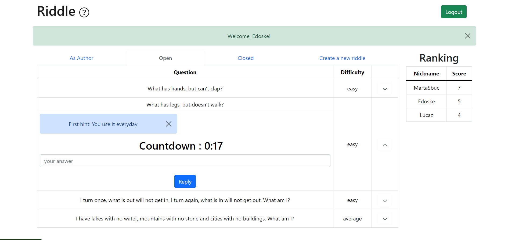

# Exam #2: "Riddles"
## Student: s301584 MANNAIOLI GIULIA 

## React Client Application Routes

- Route `/`: It is the entry point of the web application. It shows the top-3 ranking, the login form and the 'Enter as anonymous' button.
- Route `/anonymous`: if the user click the button 'Enter as Anonymous' he is redirected to this route. It shows the list of the riddles, their difficulty and their status, and the top-3 ranking.
- Route `/author`:  when the user logs in he is redirected to this route. He can choices to create a new answers, to see all the riddles he posted as author and to see all the other riddles, and the top-3 ranking.
- Route `/*`: It matches all the other routes, indicating to the user that the requested page does not exists.

## API Server

### __Create a new session (login)__

URL: `/api/sessions`

HTTP Method: POST

Description: Create a new session starting from given credentials.

Request body:
```
{
  "username": "giulia.mannaioli@gmail.com",
  "password": "password"
}
```

Response: `200 OK` (success) or `500 Internal Server Error` (generic error).

Response body: _None_

### __Get the current session__

URL: `/api/sessions/current`

HTTP Method: GET

Description: Verify if the given session is still valid and return the info about the logged-in user. A cookie with a valid session id must be provided.

Request body: _None_ 

Response: `201 Created` (success) or `401 Unauthorized` (error).

Response body:
```
{
  "username": "giulia.mannaioli@gmail.com",
  "id": "1",
  "name": "Giulia"
}
```

### __Destroy the current session (logout)__

URL: `/api/sessions/current`

HTTP Method: DELETE

Description: Delete the current session. A cookie with a valid session id must be provided.

Request body: _None_

Response: `200 OK` (success) or `500 Internal Server Error` (generic error).

Response body: _None_


### __List all the riddles__

URL: `/api/riddles`

HTTP Method: GET

Description: Get the full riddle list.

Request body: _None_

Response: `200 OK` (success) `500 Internal Server Error` (generic error).

Response body:
```
[
  {"CodR": 1
  "CodU": 3
  "answer": "egg"
  "difficulty": 1
  "hint1": "hen"
  "hint2": "chicken"
  "life": 60
  "question": "What has to be broken before you can use it?"
  "startTimer": null
  "state": 0},
 {
  "CodR": 14
  "CodU": 4
  "answer": "table"
  "difficulty": 1
  "hint1": "You use it everyday"
  "hint2": "Usually it is made of wood"
  "life": 60
  "question": "What has legs, but doesn’t walk?"
  "startTimer": 0
  "state": 1
 },
  ...
]
```


### __Get Riddles By Author__

URL: `/api/riddlesauthor`

HTTP Method: GET

Description: Get the riddles posted by the user logged.

Request body: _None_

Response: `200 OK` (success), `401 NOT AUTHORIZED` (the credentials to log in are not correct) or `500 Internal Server Error` (generic error).


Response body:
```
[
  {"CodR": 1
  "CodU": 1
  "answer": "egg"
  "difficulty": 1
  "hint1": "hen"
  "hint2": "chicken"
  "life": 60
  "question": "What has to be broken before you can use it?"
  "startTimer": null
  "state": 0},
 {
  "CodR": 14
  "CodU": 1
  "answer": "table"
  "difficulty": 1
  "hint1": "You use it everyday"
  "hint2": "Usually it is made of wood"
  "life": 60
  "question": "What has legs, but doesn’t walk?"
  "startTimer": 0
  "state": 1
 },
  ...
]
```
### __Get ranking__

URL: `/api/ranking`

HTTP Method: GET

Description: Retrieve top-3 ranking.

Request body: _None_


Response: `200 OK` (success) or `500 Internal Server Error` (generic error)
        

Response body:

```
  [
  { "id": 3, 
    "nickname": 'MartaSbuc', 
    "ranking": 6 },
  { "id": 1, 
    "nickname": 'Giul629', 
    "ranking": 3 },
  { "id": 5, 
    "nickname": 'Edoske', 
    "ranking": 2 }
]"

```
### __Get the answers of the riddle__

URL: `/api/<riddle>/answers`

HTTP Method: GET

Description: Retrieve th elist of the answers for the specific riddle.

Request body: _None_

Request params: the cod of the riddle

Response: `200 OK` (success) or `500 Internal Server Error` (generic error)
        

Response body:

```
 [
  { CodA: 10, CodR: 4, CodU: 3, text: 'pebble', correct: 0 },
  { CodA: 12, CodR: 4, CodU: 3, text: 'heart', correct: 0 },
  { CodA: 13, CodR: 4, CodU: 3, text: 'sponge', correct: 1 }
]

```


### __Create a new riddle__

URL: `/api/riddlesauthor`

HTTP Method: POST

Description: create a new riddle.

Request body:
```
{ "CodU": 1
  "answer": "egg"
  "difficulty": 1
  "hint1": "hen"
  "hint2": "chicken"
  "life": 60
  "question": "What has to be broken before you can use it?"
  "startTimer": null}

```

Response: `401 NOT AUTHORIZED` (the user is not logged in), `201 Created` (success), `422 Unprocessable Entity`(the request is not in the specified format) or`503 Service Unavailable` (generic error).


### __Post a new answer__

URL: `/api/riddlesauthor`

HTTP Method: POST

Description: When the user reply to a riddle he posts a new answer.

Request body:
```
{ CodR: 4, 
  CodU: 3, 
  text: 'pebble'}

```

Response: `401 NOT AUTHORIZED` (the user is not logged in), `201 Created` (success), `422 Unprocessable Entity`(the request is not in the specified format) or`503 Service Unavailable` (generic error).


## Database Tables

- **Table `users`**
  Contains the information about the user:
  |Column|Description|
  |-|-|
  |`id`|Database identifier of the student. It is the **primary key** of the table|
  |`nickname`|Nickname of the user|
  |`username`|Email of the user. It is always composed as <br> `<name>.<surname>@gmail(hotmail).com(it)` |
  |`hash`| Hash of the password of the student. <br> It is used to match the password inserted in the login form |
  |`salt`|Salt used to compute the password of the student. <br> It is used to match the password inserted in the login form|
  |`ranking`|The score of the user|


- **Table `riddles`**
  Contains the whole list riddles:
  |Column|Description|
  |-|-|
  |`CodR`|Unique identifier of the riddle. It is the **primary key** of the table|
  |`CodU`|Unique identifier of the user|
  |`question`|The question|
  |`difficulty`|Difficulty of the riddle|
  |`life`|Time to answer the riddle|
  |`hint1`|The first hint that the user can see if the remaining time is less than 50%|
  |`hint2`|The second hint that the user can see if the remaining time is less than 25%|
  |`state`|0 if the riddle is closed, 1 if it is open|
  |`answer`|The correct answer to the question|
  |`startTimer`|  NULL when no one has answered, dateTime when the first answer is given, it becomes 0 when the riddle is closed.|

- **Table `answers`**
  contains all the given answers:
  |Column|Description|
  |-|-|
  |`CodA`|Unique identifier of the answer. It is the **primary key** of the table|
  |`CodR`|Unique identifier of the riddle|
  |`CodU`|Unique identifier of the user|
  |`text`|The given answer|
  |`correct`|1 if the answer is correct, 0 otherwise|
  

## Main React Components

- `Header` (in `Header.js`): shows navbar at the top pf the page. Contains logout button
- `RankList` (in `RankList.js`): shows the top 3 ranking.
---
- `LoginRoute` (in `Views.js`): shows login form and the button to open the anonymous list
- `LoginForm`  (in `AuthComponents.js`): It contains the login form to authenticate a user in the web application. It requires the email (`username`) and the password (`password`). It calls the `props.login` of the `App` component.
- `LogoutButton` (in `AuthComponents.js`): Button to handle logout
- `AnonymousList` (in `AnonymousList.js`): shows the ist of riddles that the anoonymous can see
---
- `AuthorRoute` (in `Views.js`): shows the different riddle list or the "create new riddle"
- `AuthorList` (in `AuthorList.js`): the user can choose to see the riddles published by him, the closed and the open one.
- `CreateForm` (in `AuthorList.js`): shows the form to create a new riddle
---
- `Timer` (in `Timer.js`): handle the timer and shows the countdown and the hints


## Screenshot


### Riddle answering page

 


## Users Credentials

| Username | Password | 
|--|--|
| giulia.mannaioli@gmail.com|password|
| virginia.mazzei@gmail.com|password|
| marta.delellis@hotmail.it|password|
| luca.zanetti@polito.it|password|
| edoardo.pelosin@gmail.com|password|
| davide.aiello@gmail.com|password|